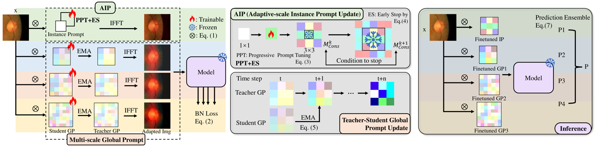

# :page_facing_up: MGIPT
This is the official pytorch implementation of our BIBM 2025 paper "[Multi-Scale Global-Instance Prompt Tuning for Continual Test-time Adaptation in Medical Image Segmentation](https://ieeexplore.ieee.org/abstract/document/11356288/?casa_token=_e0ORbUVTbwAAAAA:9sJ4kAaOs3E6wQnP-UDm3WH1LhxeoqbBPv9v-KYl6tpxBuIU5j717rI2LdMwjCq_KM_zhL9cDkY)".

<div align="center">
  
</div>

## Environment
```
CUDA 10.1
Python 3.7.0
Pytorch 1.8.0
CuDNN 8.0.5
```
Our Anaconda environment is also available for download from ```llr``` dir.

Upon decompression, please move ```llr``` to ```your_root/anaconda3/envs/```. Then the environment can be activated by ```conda activate llr```.

## Data Preparation
The preprocessed data can be downloaded from [Google Drive](https://drive.google.com/drive/folders/1axgu3-65un-wA_1OH-tQIUIEHEDrnS_-?usp=drive_link).

## Pre-trained Models
Download pre-trained models from [Google Drive](https://drive.google.com/drive/folders/1WWRbFLN3ELGbNs9jnl5bt4bIHuha8jWw?usp=drive_link) and drag the folder 'models' into the folder 'OPTIC' or 'POLYP'.

You can also train your own models from scratch following:

* **OD/OC Segmentation**
```
CUDA_VISIBLE_DEVICES=0 python OPTIC/train_source.py --Source_Dataset RIM_ONE_r3 --path_save_log OPTIC/logs --path_save_model OPTIC/models --dataset_root your_dataset_root
```
* **Polyp Segmentation**

Please refer to the Pytorch implementation of [PraNet](https://github.com/DengPingFan/PraNet).

## How to Run
Please first modify the root in ```MGIPT_OPTIC.sh``` and ```MGIPT_POLYP.sh```, and then run the following command to reproduce the results.
```
# Reproduce the results on the OD/OC segmentation task
bash MGIPT_OPTIC.sh
# Reproduce the results on the polyp segmentation task
bash MGIPT_POLYP.sh
```

## Citation ✏️
If this code is helpful for your research, please cite:
```
@inproceedings{li2025multi,
  title={Multi-Scale Global-Instance Prompt Tuning for Continual Test-time Adaptation in Medical Image Segmentation},
  author={Li, Lingrui and Zhou, Yanfeng and Pu, Nan and Chen, Xin and Zhong, Zhun},
  booktitle={2025 IEEE International Conference on Bioinformatics and Biomedicine (BIBM)},
  pages={2395--2402},
  year={2025},
  organization={IEEE}
}
```
## Acknowledgement
Our code is heavily adopted from the Pytorch implementations of [VPTTA](https://github.com/Chen-Ziyang/VPTTA).

## Contact
Lingrui Li (lingrui.li@nottingham.ac.uk)
